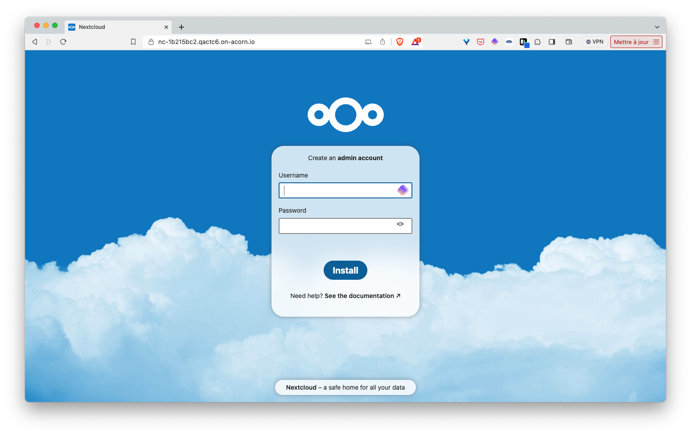

## Postgres Database

PostgreSQL is an open-source object-relational database system that uses and extends the SQL language. Known for its robustness and reliability, it supports advanced data types and advanced performance optimization, offering features like complex queries, atomic transactions, and concurrent connections.

## Postgres as an Acorn Service

This Acorn provides a Postgres database as an Acorn Service. It can be used to easily get a Postgres database for your application during development. The current service runs a single Postgres container backed by a persistent volume and define credentials for an admin user.

This Postgres instance:
- is backed by a persistent volume
- generate credentials for an admin user

The Acorn image of this service is hosted in GitHub container registry at [ghcr.io/acorn-io/postgres](ghcr.io/acorn-io/postgres). 

Currently this Acorn does not have any configuration options, but some will be added later on like:
- the possibility to indicate the Redis version to use
- the size of the persistent volume

## Usage

In the examples folder you can find a sample application using this Service. 

This example can be run with the following command (make sure to run it from the *examples* folder)

```
acorn run -n api
```

After a few tens of seconds you will be returned an http endpoint you can use to acces the NextCloud installation UI.



## Deploy the app to your Acorn Sandbox

Instead of managing your own Acorn installation, you can deploy this application in the Acorn Sandbox, the free SaaS offering provided by Acorn. Access to the sandbox requires only a GitHub account, which is used for authentication.

[](https://beta.acorn.io/run/ghcr.io/acorn-io/postgres/examples:v%23.%23-%23?ref=lucj)

An application running in the Sandbox will automatically shut down after 2 hours, but you can use the Acorn Pro plan to remove the time limit and gain additional functionalities.
