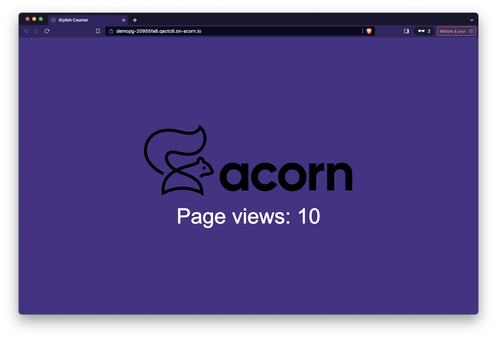

## Postgres Database

PostgreSQL is an open-source object-relational database system that uses and extends the SQL language. Known for its robustness and reliability, it supports advanced data types and advanced performance optimization, offering features like complex queries, atomic transactions, and concurrent connections.

## Postgres as an Acorn Service

This Acorn provides a Postgres database as an Acorn Service. It can be used to easily get a Postgres database for your application during development. The current service runs a single Postgres container backed by a persistent volume and define credentials for an admin user.

This Postgres instance:
- is backed by a persistent volume
- generate credentials for an admin user

The Acorn image of this service is hosted in GitHub container registry at [ghcr.io/acorn-io/postgres](ghcr.io/acorn-io/postgres). 

Currently this Acorn has the following configuration options:
- *dbName*: name of the database (*postgres* by default)
- *dbUser*: name of the admin user (*postgres* by default)

## Usage

The [examples folder](https://github.com/acorn-io/postgres/tree/main/examples) contains a sample application using this Service. This app consists in a Python backend based on the FastAPI library, it displays a web page indicating the number of times the application was called, a counter is saved in the underlying Postgres database and incremented with each request. The screenshot below shows the UI of the example application. 



To use the Postgres Service, we first define a *service* property in the Acornfile of the example app:

```
services: db: image: "ghcr.io/acorn-io/postgres:v#.#-#"
```

Next we define the application container:

```
containers: app: {
	build: {
		context: "."
		target:  "dev"
	}
	consumes: ["db"]
	ports: publish: "8000/http"
	env: {
		POSTGRES_HOST:     "@{service.db.address}"
		POSTGRES_DB:       "@{service.db.data.dbName}"
		POSTGRES_USER:     "@{service.db.secrets.admin.username}"
		POSTGRES_PASSWORD: "@{service.db.secrets.admin.password}"
	}
}
```

This container is built using the Dockerfile in the examples folder. Once built, the container consumes the Postgres service using properties provided by the service:
- @{service.db.address} : URL to connect to the postgres service
- @{service.db.data.dbName}: database name
- @{service.db.secrets.admin.username}: username of the admin user
- @{service.db.secrets.admin.password}: password of the admin user

This example can be run with the following command (to be run from the *examples* folder)

```
acorn run -n app
```

After a few tens of seconds an http endpoint will be returned. Using this endpoint we can access the application and see the counter incremented on each reload of the page.

Once we're done, we can remove the app:

```
acorn rm -af app
```

## Deploy the app to your Acorn Sandbox

Instead of managing your own Acorn installation, you can deploy this application in the Acorn Sandbox, the free SaaS offering provided by Acorn. Access to the sandbox requires only a GitHub account, which is used for authentication.

[](https://acorn.io/run/ghcr.io/acorn-io/postgres/examples:v%23.%23-%23)

An application running in the Sandbox will automatically shut down after 2 hours, but you can use the Acorn Pro plan to remove the time limit and gain additional functionalities.
